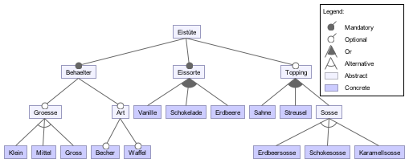

# Aufgabenblatt 1
## 1. Eiscreme-Analogie:
**Wir schreiben das Jahr 2026. Sie arbeiten mittlerweile als Eiscreme-Verkäufer. Zum Glück errinnern Sie sich noch an eine Vorlesung über Software-Produktlinien, die Sie vor über 10 Jahren gehört haben und entdecken viele Gemeinsamkeiten zwischen dem Verkauf der verschiedenen Eistüten und der Featureorienterten Entwicklung von Software-Produktlinien.**
* a) Skizzieren Sie den typischen Arbeitsablauf eines Eiscremeverkäufers der Bestellungen entgegennimmt und Eistüten zusammenstellt. Nehmen Sie dabei Bezug auf die Begriffe Feature, Feature Model, Domänenartefakte, Konfiguration, Produkt und deren Bezug zur Eiscreme-Analogie. (Tipp: Verwenden Sie eine Darstellung ähnlich der Abbildung aus der Vorlesung)
  * Ein *Feature* ist ein charakteristisches oder Endbenutzer-sichtbares Verhalten eines Softwaresystems. Im Produktlinien-Engineering werden Merkmale verwendet, um Gemeinsamkeiten und Unterschiede zwischen den Stakeholdern zu spezifizieren und zu kommunizieren sowie Struktur, Wiederverwendung und Variation in allen Phasen des Software-Lebenszyklus zu steuern.
  * Ein *Produkt* einer Produktlinie wird durch eine gültige Merkmalsauswahl (eine Untermenge der Merkmale der Produktlinie) spezifiziert. Eine Feature-Selektion ist nur dann gültig, wenn sie alle Feature-Abhängigkeiten erfüllt.
  * Eine *Domäne* ist ein Gebiet des Wissens, das:
    * sich auf die Maximierung der Zufriedenheit der dortigen Akteure stützt,
    * enthält eine Reihe von Konzepten und Begriffen, die von Praktikern in diesem Bereich verstanden wird,
    * und beinhaltet das Wissen, wie man Software - Systeme (oder Teile von Software-Systemen) in diesem Bereich bildet.

  Feature-Modell:
  

  Feature-Selektion:
  * Eistüte
    * Behälter
      * Größe
        * Klein
        * Mittel
        * Groß
      * Art
        * Becher
        * Waffel
    * Eissorte
      * Vanille
      * Schoko
      * Erdbeere
    * Topping
      * Sahne
      * Streußel
      * Soße
        * Erdbeer
        * Schoko
        * Karamell

  Die Konfiguration ist die Auswahl des Kunden.
  Das fertige Produkt wird vom Verkäufer genäß der Vorgaben hergestellt.

* b) Nennen Sie 10 mögliche Features einer solchen Eiscreme-Produktlinie. Gibt es Abhängigkeiten zwischen den Features?
  * mögliche Features siehe oben
  * Abhängigkeiten bestehen
    * Anzahl der möglichen Kugeln ist abhängig von der gewählten Größe des Behälters
    * Abhängig von der Verfügbarkeit könnte es z.B. keinen großen Becher geben

* c) Welches sind die wichtigsten Unterschiede zwischen der Entwicklung von Eiscreme und Software in Bezug auf Produktlinienentwicklung?
  * Eiscreme kann nicht wiederverwendet werden
  

---

## 2. Im Rahmen der praktischen Übung werden Sie FeatureIDE zur Implementierung von Software-Produktlinien nutzen. Verwenden Sie die von uns zur Verfügung gestellte Dokumentation (am Dienstag in der Vorlesung) um FeatureIDE zu installieren und sich in die Grundfunktionalität einzuarbeiten.
*(Wenn Sie Zugang zu einem PC benötigen, bitte per email melden!)*

* a) Was ist die Grundidee von FeatureIDE? Wofür kann es genutzt werden?

* b) Was ist ein Composer?

* c) Was sind die Hauptbestandteile eines FeatureIDE Projektes? Erläutern Sie die Zusammenhänge!

* d) Entwickeln Sie mit FeatureIDE ein Feature-Modell für die Eiscreme-Produktlinie! Erläutern Sie die wichtigsten Elemente! Welche Beziehungen bestehen zwischen den einzelnen Features?
